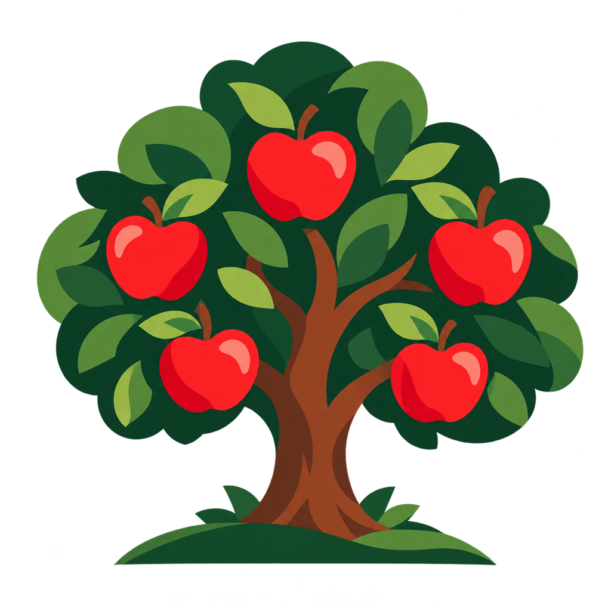

# Steady Orchard

Steady Orchard is an open-source community organization dedicated to helping open-source projects thrive. We build tools to help maintainers manage incoming contributions and help contributors prepare stronger, more actionable submissions.

Open source depends on people sharing their time, knowledge, and judgment. Every issue and pull request asks someone to investigate a claim, understand a proposed change, and decide how it fits the project and its goals. We want to make that exchange easier for everyone involved.

## Our focus

We want people to have a clear path from an idea or problem report to a useful contribution. That starts with understanding what a project needs, knowing what information to provide, and getting feedback that helps move the work forward.

We also want maintenance to be more sustainable. Reducing repeated investigation and coordination can leave maintainers more time for difficult decisions, project direction, and their communities. Making reasoning and project knowledge easier to share helps people build on each other's work.

Our longer-term vision extends to the broader work of open-source project management. We aim to support lasting collaboration while keeping people responsible for their projects' direction and decisions.

As our tools and community grow, we'll keep refining how we support trustworthy collaboration in open source.

## Our values

Quality means more than passing tests or presenting a convincing explanation. A useful contribution addresses a real need, fits the project's direction, and gives others enough context to understand and evaluate it. The depth of review should reflect the scope and consequences of the change.

People remain responsible for their work and decisions. Maintainers set expectations and retain authority over acceptance and merging. Contributors remain responsible for the quality and intent of their submissions. We believe contributions should be assessed on their substance, regardless of whether AI helped produce them.

Feedback should help people improve their work. It should explain what needs attention, why it matters, and how to address it, with respect for the person contributing. People should have room to clarify, revise, or challenge an assessment.

Helpful automation earns trust through clear reasoning, visible evidence, and honesty about uncertainty. Assessments should make clear what was verified, what information is missing, and which checks could not finish. An incomplete check does not mean a contribution is wrong.

We intend to measure our progress through better contributions, reduced maintainer workload, and continued access for people with valuable work to share. Those are goals to test against experience. Community feedback and observed results should guide what we improve.

## Why the name?

An orchard flourishes through patient attention, dependable care, and the contributions of many hands. Steady Orchard brings that same spirit to open source: helping people build better collaboration, stronger projects, and more sustainable communities.

## What we're building

Our initial product, **Patch Steward**, is in development, with an initial focus on GitHub issues and pull requests.

Patch Steward is being designed to combine AI-assisted investigation, reproducible checks, and actionable feedback to help screen and route contributions. Its goal is to help establish whether a submission has supporting evidence, fits the project's direction, and is ready for human review. Contributors should understand what their work needs next, and maintainers should have clearer evidence for their decisions.
